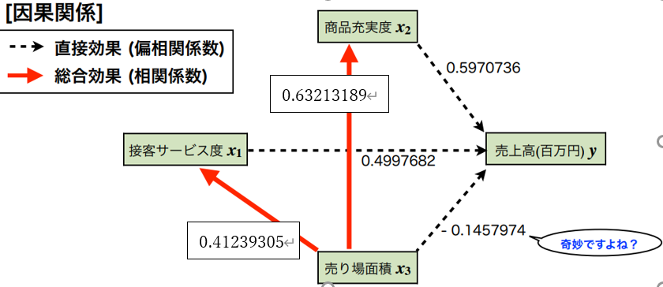
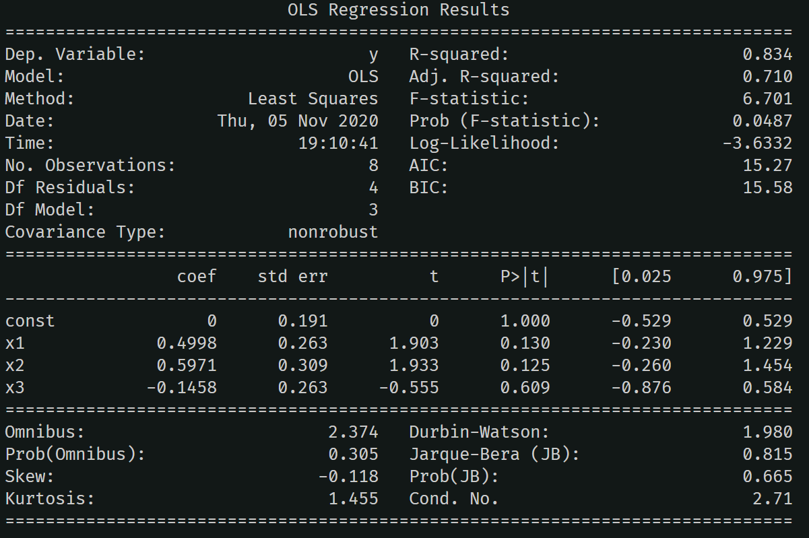

## 機械学習(旧応用ネットワークシステム)第６回レポート
学籍番号：18t1040x 氏名:加藤正隆  

### 課題  
先週の課題に対して重回帰分析した結果，奇妙なことに，売り場面積x3が売上高yに悪影響を与えているという結果が得られた．どうも納得が行かないので，今回学んだパス解析を用いて，より詳細に分析することにする．下図を参考にしつつ，売り場面積x3が売上高yに与える影響を再考せよ.  
以下のプログラムを用いて、パス解析を行った。  
```python
import numpy as np

#標準化をする関数
def standard(array):
    return (array-np.mean(array))/np.std(array, ddof=1)

#相関係数を求める関数
def soukan(array1, array2):
    array1_h = standard(array1)
    array2_h = standard(array2)
    return np.corrcoef(standard(array1_h), standard(array2_h))[0, 1]

x1 = [8, 7, 5, 4, 6, 2, 3, 9]
x2 = [8, 7, 9, 3, 8, 3, 6, 7]
x3 = [4, 7, 8, 3, 8, 5, 6, 9]
y = [18, 12, 14, 6, 12, 8, 10, 16]

indire_31y= soukan(x3, x1)*0.4997682
indire_32y= soukan(x3, x2)*0.5970736
alleff = indire_32y+indire_31y-0.1457974 

print("3->1", soukan(x3, x1))
print("3->2", soukan(x3, x2))
print(alleff)
```
実行結果は以下の通りになった。  
```
3->1 0.41239304942116134
3->2 0.6321318933586436
0.43773279724418623
```
**結果と考察**  
1. $x_3$->$y$への直接効果$=-0.1457974$
2. $x_3$->$x_{1}$->$y$への間接効果$=0＝412393049\times0.4997682=0.206100932$
2. $x_3$->$x_{2}$->$y$への間接効果$=0.632121893\times0.5970736=0.377423294292$  
4. 合計$＝-0.1457974+0.206100932+0.377423294292=0.43773279724418623$  

 パス解析の表は以下の通りになる.  

 

**最終結論**  
小型軽量$x_3$の間接結果によれば、売り場面積の拡大が、商品充実度を高めることになり、結果的に売上高の向上に役立っている。また、売り場面積が拡大することで、接客サービスが低下していないことが読み取れる。  

**Pythonのライブラリを用いたパス解析**  
以下のプログラムを作製した。
```python
x1_h = standard(x1)
x2_h = standard(x2)
x3_h = standard(x3)
y_h = standard(y)
N = len(y)
X_h = np.c_[np.ones(N), x1_h, x2_h, x3_h] 
import statsmodels.api as sm
#モデルの設定 (最小2乗法による回帰分析)
model = sm.OLS(y_h, X_h)
#回帰分析の実行
results = model.fit()
print( results.summary() )
```
実行結果は以下の通りになった。　　



**考察**  
F検定では、Prob(F-statistic)=0.0487<0.05より、帰無仮説：回帰式は役に立たない、$R^2=0$, を棄却することができる。つまり、回帰式が役に立つことが分かった。t検定では、$x_1, x_2, x_3$のいずれの値も、0.05未満ではないため、回帰式は役に立たないと判定される。

**参考文献**  
[LiNGAM入門。気軽に因果関係を推定する(統計的因果探索)](https://qiita.com/tawash/items/73d570cdabebe863df67)  
[Pythonによる因果推論と因果探索（初心者の方向け)](https://qiita.com/sugulu_Ogawa_ISID/items/2cffb239b44853b07f70)
